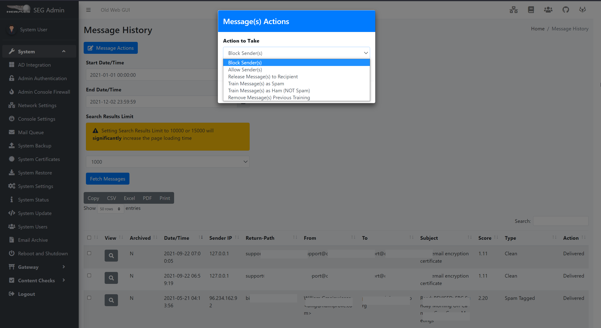
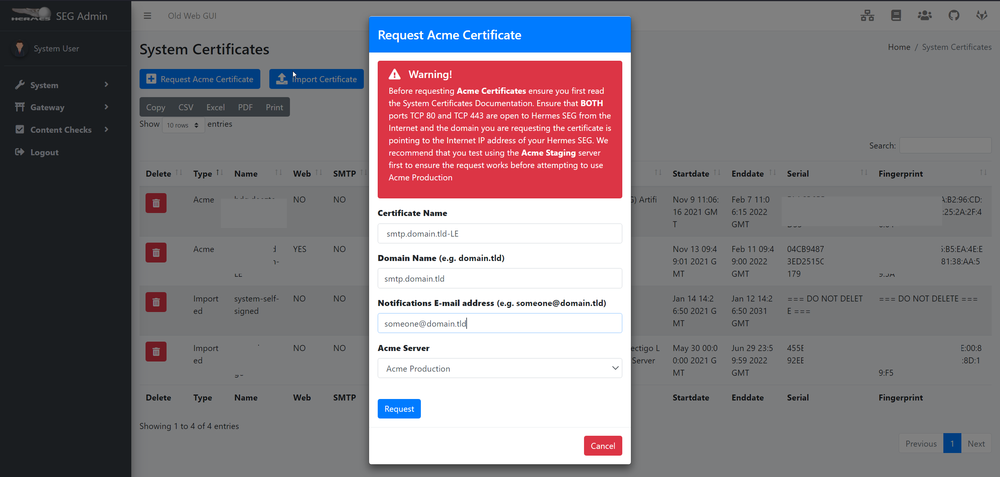

<h1 align="center"> Hermes Secure Email Gateway </h1> <br>
<p align="center">
  <a href="https://www.deeztek.com/products/hermes-secure-email-gateway/">
    
  </a>
</p>

<p align="center">
  Open Source Unified Secure Email Gateway
</p>

## Table of Contents

- [About](#about)
- [Features](#features)
- [Screenshots](#screenshots)
- [Installation](#installation)
- [Getting Started Guide](#getting-started-guide)
- [Documentation](#documentation)
- [Support](#support)
- [Bugs](#bugs)

## About

Hermes Secure Email Gateway is a Free Open Source Ubuntu 18.04 Server based Email Gateway that provides Spam, Virus and Malware protection, full in-transit and at-rest email encryption as well as email archiving. It features the latest email authentication techniques such as SPF (Sender Policy Framework), DKIM (DomainKeys Identified Mail) and DMARC (Domain-based Message Authentication, Reporting and Conformance) in order to combat email spoofing, phishing, scams, email compromise attacks and spam.

Hermes Secure Email Gateway combines Open Source technologies such as Postfix, Apache SpamAssassin, ClamAV, Amavisd-new and CipherMail under one unified web based Web GUI for easy administration and management of your incoming and ougoing email for your organization.

It can be deployed to protect your in-house email solution as well as cloud email solutions such as Google Mail and Microsoft Office 365.

## Features

* Malware and Spam Protection
* In Transit Email Encryption via Encrypted PDF, S/MIME, PGP and SMTP TLS
* Administrator Console
* User Console
* Built-In Email Archiving
* Active Directory Integration (PRO Feature)
* Searchable Event Logs
* Searchable Messages by Date/Time, Subject, Sender, Receiver, Type, Action
* Train Messages as Spam/Ham, Block/Allow Senders, Release to Recipient, Download Messages
* Integration with 3rd Party Threat Feeds such as Malware Patrol, Sanesecurity, Securite Info, Yara (Pro Feature)
* Built-In Firewall (PRO Feature)
* Multifactor Authentication
* Lets Encrypt (ACME) Certificate Integration (PRO Feature)
* haveibeenpwned.com Password Check Integration
* Custom File Expressions (PRO Feature)
* Custom File Extensions (PRO Feature)
* Custom Spam Filter Tests (PRO Feature)
* Custom Messages Rules (PRO Feature)
* Antivirus Signature Bypass (PRO Feature)
* 3rd Party SSL Certificates
* SPF, DKIM Check, DKIM Sign, DMARC
* Per-User Spam, Virus and File Policies
## Screenshots




## Installation

Hermes SEG can be easily installed in your existing Ubuntu 18.04 server machine by utilizing the **ubuntu_hermes_1804_install.sh** script. The script requires that you have a fully updated Ubuntu 18.04 server installation and that you have a /mnt/data directory for database and email archive storage. 

**Required Information**

The script will prompt you for the following information before it starts installation. Ensure you have that information available before you begin:

* MySQL(MariaDB) root user password you wish to use
* MySQL(MariaDB) username you wish to use with the hermes database (Example: hermes)
* MySQL(MariaDB) password you wish to use with the hermes database user
* MySQL(MariaDB) username you wish to use with the Syslog database (Example: rsyslog)
* MySQL(MariaDB) password you wish to use with the Syslog database user
* MySQL(MariaDB) username you wish to use with the cipermail database (Example: ciphermail)
* MySQL(MariaDB) password you wish to use with the ciphermail database user
* MySQL(MariaDB) username you wish to use with the opendmarc database (Example: opendmarc)
* MySQL(MariaDB) password you wish to use with the opendmarc database user
* Lucee Server and Web Administrator password you wish to use
* System Mailname (Example: smtp.domain.tld)


The **Configure /mnt/data partition** directions below assume you have a 250GB secondary drive which you will partition, format and mount as /mnt/data. 

Technically a secondary drive for the /mnt/data directory is not a requirement but it's highly recommended for performance reasons. If you don't wish to use a secondary drive for the /mnt/data directory, simply create a /mnt/data directory in your system and skip to the **Quick script install and run instructions** section. 

**Configure /mnt/data partition**

`sudo mkdir /mnt/data`

`sudo fdisk -l `

Look for 250 GB drive you created earlier device ID, usually /dev/sdb. Ensure you select correct device ID before running the commands below)

**Create partititon**

`sudo fdisk /dev/sdb`

* Hit "n" to add new partition
* Hit "p" for primary partition
* Hit "Enter" for partition 1
* Hit "Enter" for default first sector
* Hit "Enter" for default last sector
* Hit "w" to write changes to disk and exit

**Format Partition**

`sudo mkfs.ext4 /dev/sdb1`

**Mount Partition to /mnt/data**

`sudo mount /dev/sdb1 /mnt/data`

**Get disk UUID**

`ls -l /dev/disk/by-uuid`

**Edit /etc/fstab**

`sudo vi /etc/fstab`

**Add the following in /etc/fstab where DEVICE_ID is the UUID from the command above**

`UUID=DEVICE_ID /mnt/data               ext4    errors=remount-ro 0       1`

**Verify drive is mounted**

`sudo df -h`

**Should yield output similar to below:**

```
Filesystem      Size  Used Avail Use% Mounted on
udev            1.9G     0  1.9G   0% /dev
tmpfs           395M  1.1M  394M   1% /run
/dev/sda2        79G  5.5G   69G   8% /
tmpfs           2.0G     0  2.0G   0% /dev/shm
tmpfs           5.0M     0  5.0M   0% /run/lock
tmpfs           2.0G     0  2.0G   0% /sys/fs/cgroup
/dev/loop0       87M   87M     0 100% /snap/core/4917
/dev/loop1       90M   90M     0 100% /snap/core/8039
tmpfs           395M     0  395M   0% /run/user/1000
/dev/sdb1       246G   61M  233G   1% /mnt/data
```

Reboot and ensure /mnt/data gets mounted automatically

**Quick script install and run instructions**

Git clone the Hermes SEG repository:

`sudo git clone https://github.com/deeztek/Hermes-Secure-Email-Gateway.git`

This will clone the repository and create a Hermes-Secure-Email-Gateway directory in the directory you ran the git clone command from.

Change to the **Hermes-Secure-Email-Gateway** directory:

`cd Hermes-Secure-Email-Gateway/`

Make script executable:

`sudo chmod +x ubuntu_hermes_install.sh`

Run the script as root:

`sudo ./ubuntu_hermes_install.sh`

## Getting Started Guide

Ensure you follow the [Getting Started Guide](https://docs.deeztek.com/books/hermes-seg-administrator-guide/page/getting-started) to get your Hermes SEG installation configured quickly and correctly. 

## Documentation

Check out the [Hermes SEG Administrator](https://docs.deeztek.com/books/hermes-seg-administrator-guide) and [Hermes SEG User](https://docs.deeztek.com/books/hermes-seg-user-guide) guides

## Support

Post your questions at:
[https://github.com/deeztek/Hermes-Secure-Email-Gateway/discussions](https://github.com/deeztek/Hermes-Secure-Email-Gateway/discussions)

Chat with us on Matrix:
[https://matrix.to/#/#hermesseg:matrix.org](https://matrix.to/#/#hermesseg:matrix.org)

## Bugs

Bugs can be posted on Github Issues at:

[https://github.com/deeztek/Hermes-Secure-Email-Gateway/issues](https://github.com/deeztek/Hermes-Secure-Email-Gateway/issues)


